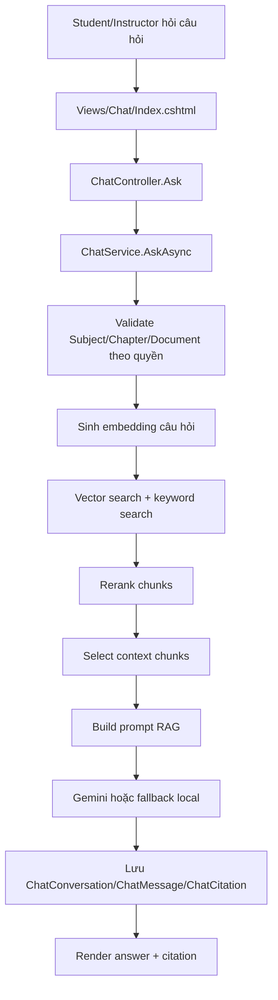

# Giải thích chi tiết Chatbot/RAG trong DocXM

Tài liệu này tập trung vào phần chatbot/RAG và phần gọi AI/Gemini của dự án DocXM. Tài liệu không ghi API key, password, token hoặc connection string thật; nếu môi trường local có secret thì cần giữ trong user secrets/biến môi trường và mask khi chia sẻ.

## 1. Tổng quan chatbot

Chatbot của DocXM dùng để hỏi đáp theo tài liệu học tập đã upload vào hệ thống. Người dùng không chat tự do với một AI tổng quát; thay vào đó chatbot trả lời dựa trên các chunk tài liệu đã được trích xuất, index vector và lọc theo quyền truy cập.

Điểm khác với chat AI bình thường:

- Chatbot phải kiểm tra quyền Subject/Document trước khi lấy context.
- Câu trả lời được sinh từ nội dung tài liệu đã index, không chỉ dựa vào kiến thức chung của model.
- Câu trả lời có citation để người đọc biết nguồn đến từ document/chunk nào.
- Nếu không có context phù hợp, chatbot trả lời an toàn thay vì suy đoán.

RAG là cần thiết vì tài liệu học tập nằm trong database/file upload của hệ thống, không nằm sẵn trong model. RAG giúp lấy những đoạn liên quan nhất từ tài liệu rồi đưa vào prompt để Gemini hoặc fallback local tạo câu trả lời có căn cứ.

## 2. Project/file liên quan tới chatbot

### Presentation

- `Presentation/Controllers/ChatController.cs`: nhận request từ UI, giữ conversation hiện tại trong session, build `ChatScopeDto`/`ChatAskDto`, gọi `ChatService`.
- `Presentation/Views/Chat/Index.cshtml`: hiển thị scope Subject/Chapter/Document, lịch sử hội thoại, answer và citation.

### BusinessLogic

- `BusinessLogic/Services/ChatService.cs`: trung tâm luồng RAG, gồm validate scope, retrieve chunk, rerank, build prompt, gọi answer service, lưu message/citation.
- `BusinessLogic/DTOs/ChatDtos.cs`: DTO cho scope chat, document option, message, citation và ask/answer.
- `BusinessLogic/Options/RagDebugOptions.cs`: cấu hình bật/tắt RAG debug logging an toàn.
- `BusinessLogic/DependencyInjection.cs`: đăng ký `ChatService` và `RagDebugOptions`.

### DataAcessLayer

- `DataAcessLayer/Repositories/ChatRepository.cs`: query Subject/Chapter/Document/Chunk/Conversation, luôn lọc theo owner hoặc `SubjectPermissions`.

### BusinessObjects

- `ChatConversation`: lưu phiên hội thoại và scope Subject/Chapter/Document.
- `ChatMessage`: lưu câu hỏi người dùng và câu trả lời AI.
- `ChatCitation`: lưu nguồn trích dẫn gồm document/chunk/page/snippet/score.
- `DocumentChunk`: lưu nội dung chunk, section title, token count và thông tin liên quan vector.

### AIService

- `IEmbeddingService`: abstraction sinh embedding.
- `GeminiEmbeddingService`: implementation gọi Gemini để sinh embedding khi Gemini được cấu hình.
- `DeterministicEmbeddingService`: fallback embedding local, không gọi AI thật.
- `IAnswerGenerationService`: abstraction sinh câu trả lời từ prompt.
- `GeminiAnswerGenerationService`: implementation gọi Gemini để sinh answer khi Gemini được cấu hình.
- `PromptAnswerGenerationService`: fallback answer local, không gọi AI thật.
- `LocalJsonVectorStore`: vector store local JSON dùng cho demo/dev.
- `GeminiApiClient`: HTTP client dùng chung để gửi request thật tới Gemini.
- `GeminiOptions`: config Gemini gồm bật/tắt, API key, base URL, model embedding/chat.
- `AIService/DependencyInjection.cs`: quyết định dùng Gemini service hay fallback local.

## 3. Luồng xử lý khi người dùng hỏi chatbot

### Bước 1: User gửi câu hỏi từ UI

Người dùng nhập câu hỏi tại `Presentation/Views/Chat/Index.cshtml`. Form POST về `ChatController.Ask(...)` trong `Presentation/Controllers/ChatController.cs`.

Dữ liệu ban đầu nằm trong `ChatIndexViewModel`, gồm:

- `ConversationId`
- `SubjectId`
- `ChapterId`
- `DocumentId`
- `Question`

Controller normalize các id, kiểm tra `ModelState`, rồi tạo `ChatAskDto` để gọi `ChatService.AskAsync(...)`.

### Bước 2: Kiểm tra user và phân quyền

`ChatController` truyền hai filter quyền xuống service:

- `OwnerUserId`: có giá trị nếu user hiện tại là Instructor.
- `ViewerUserId`: có giá trị nếu user hiện tại là Student.

Quy tắc:

- Instructor được chat với Subject mình tạo và Document mình upload.
- Student được chat với Subject được cấp quyền qua `SubjectPermissions`.
- `SubjectPermissions` được áp dụng trong `ChatRepository.GetSubjectsAsync`, `GetChaptersAsync`, `GetDocumentsAsync`, `GetIndexedDocumentsAsync`, `GetSubjectAsync`, `GetDocumentAsync`, `GetChunksByIdsAsync` và `SearchChunksByKeywordsAsync`.

Nếu Student bị revoke quyền:

- Subject không còn xuất hiện trong query theo `SubjectPermissions`.
- Document/chunk trong Subject đó không còn được trả về.
- Conversation cũ không được reuse nếu scope không còn hợp lệ.
- Khi hỏi lại, `ChatService.ValidateSubjectAsync` hoặc `ValidateDocumentAsync` sẽ báo lỗi nghiệp vụ.

### Bước 3: Xác định phạm vi chat

Scope chat gồm:

- Subject scope: bắt buộc khi hỏi.
- Chapter scope: tùy chọn để giới hạn trong một chương.
- Document scope: tùy chọn để hỏi một tài liệu cụ thể.

`ChatService.GetChatPageAsync(...)` dùng scope để build dữ liệu cho UI. Nếu có `ConversationId`, service lấy conversation cũ, sau đó kiểm tra conversation có còn khớp scope hợp lệ không.

Conversation cũ được reuse khi:

- Conversation thuộc đúng user hiện tại.
- Subject/Chapter/Document của conversation vẫn nằm trong scope hợp lệ sau khi lọc quyền.
- Khi lưu câu hỏi mới, `GetOrCreateConversationAsync` cũng kiểm tra `IsConversationInScope`.

Conversation cũ không được reuse khi:

- User không còn quyền vào Subject/Document.
- Scope mới khác Subject/Chapter/Document cũ.
- ConversationId không thuộc user hiện tại.

### Bước 4: Sinh embedding cho câu hỏi

Trong `ChatService.FindRelevantChunksAsync(...)`, câu hỏi được rewrite theo intent rồi gọi:

```text
_embeddingService.GenerateEmbeddingAsync(rewrittenQuery, EmbeddingTaskType.RetrievalQuery, ...)
```

Nếu Gemini được cấu hình, `_embeddingService` là `GeminiEmbeddingService`. Service này gọi Gemini để tạo vector embedding cho câu hỏi.

Nếu Gemini chưa cấu hình, `_embeddingService` là `DeterministicEmbeddingService`. Đây là fallback local dùng hash deterministic để tạo vector ổn định, không gọi AI thật.

Embedding biến câu hỏi thành vector để so khớp với vector của các chunk tài liệu đã index.

### Bước 5: Tìm chunk liên quan

`ChatService.FindRelevantChunksAsync(...)` kết hợp nhiều nguồn ứng viên:

- Vector search: gọi `_vectorStore.SearchAsync(...)` trên `LocalJsonVectorStore`.
- Keyword search: gọi `ChatRepository.SearchChunksByKeywordsAsync(...)`.
- Chunks từ vector search được query lại bằng database qua `ChatRepository.GetChunksByIdsAsync(...)` để đảm bảo vẫn đúng quyền.

`DocumentChunk` là đơn vị context chính của RAG. Mỗi chunk có:

- `DocumentChunkId`
- `DocumentId`
- `ChunkIndex`
- `Content`
- `SectionTitle`
- `VectorId` trong partial/vector metadata

`VectorId` liên kết chunk trong database với record vector trong local vector store.

### Bước 6: Hybrid search/rerank và chọn context

Sau khi lấy ứng viên vector/keyword, `ChatService.RankChunks(...)` tính điểm:

- `VectorScore`: điểm cosine từ vector store.
- `NormalizedVectorScore`: điểm vector chuẩn hóa.
- `LexicalScore`: mức khớp từ khóa.
- `FinalScore`: kết hợp lexical và vector score.

`SelectContextChunks(...)` chọn chunk đưa vào prompt:

- Mặc định lấy tối đa `TopRelevantChunks` chunk.
- Một số intent rõ ràng như hỏi chapter/tool/character có thể ưu tiên ít chunk hơn nếu lexical score cao.

Nếu không tìm thấy selected chunk, answer trả về:

```text
Tài liệu chưa có thông tin phù hợp.
```

### Bước 7: Build prompt

`ChatService.BuildPrompt(...)` tạo prompt RAG từ:

- `QUESTION`
- `CONTEXT`
- Danh sách nguồn gồm document id, title, file name, subject/chapter id, chunk index, page/section nếu có.
- Nội dung chunk đã trim theo giới hạn `MaxPromptChunkCharacters`.
- Yêu cầu trả lời ngắn gọn, bằng tiếng Việt, không bịa ngoài context.

Citation không yêu cầu model tự viết trong câu trả lời. Hệ thống tự lưu citation từ selected chunks và UI hiển thị riêng.

### Bước 8: Gọi AI/Gemini hoặc fallback

Trong `ChatService.AskAsync(...)`, sau khi build prompt:

```text
_answerGenerationService.GenerateAnswerAsync(prompt, ...)
```

Nếu Gemini được cấu hình, `_answerGenerationService` là `GeminiAnswerGenerationService` và request thật đi tới Gemini thông qua `GeminiApiClient.PostAsync(...)`.

Nếu Gemini chưa cấu hình, `_answerGenerationService` là `PromptAnswerGenerationService`, không gọi AI thật.

Nếu Gemini đã cấu hình nhưng lỗi runtime, `GeminiAnswerGenerationService` fallback sang `PromptAnswerGenerationService`. Tương tự, `GeminiEmbeddingService` fallback sang `DeterministicEmbeddingService` nếu embedding Gemini lỗi.

### Bước 9: Lưu kết quả chat

`ChatService.SaveChatAnswerAsync(...)` lưu:

- Conversation: lấy hoặc tạo bằng `GetOrCreateConversationAsync`.
- Message: lưu `UserQuestion`, `AiAnswer`, `CreatedAt`.
- Citation: mỗi citation lưu `DocumentId`, `DocumentChunkId`, `DocumentName`, `PageNumber`, `Snippet`, `SimilarityScore`.

Citation lấy từ selected chunks qua `MapCitation(RankedChunk)`. Vì chunks đã được lọc theo quyền trước đó, citation không trỏ sang tài liệu ngoài scope.

### Bước 10: Trả kết quả về UI

`ChatController.Ask(...)` nhận `ChatAnswerDto`, lưu `ConversationId` vào session, rồi redirect về `Index`.

`ChatController.Index(...)` gọi lại `GetChatPageAsync(...)`, lấy messages/citations và render view. `Views/Chat/Index.cshtml` hiển thị:

- Lịch sử hội thoại.
- Câu hỏi người dùng.
- Câu trả lời AI.
- Citation theo tên file, page nếu có và snippet ngắn.

## 4. Nơi thực hiện gọi Gemini API

Đường đi sinh answer:

```text
ChatService.AskAsync(...)
  -> IAnswerGenerationService.GenerateAnswerAsync(prompt, ...)
  -> GeminiAnswerGenerationService.GenerateAnswerAsync(...)
  -> GeminiApiClient.PostAsync(endpoint, request, ...)
  -> HttpClient.SendAsync(...)
```

Đường đi sinh embedding:

```text
ChatService.FindRelevantChunksAsync(...)
  -> IEmbeddingService.GenerateEmbeddingAsync(rewrittenQuery, RetrievalQuery, ...)
  -> GeminiEmbeddingService.GenerateEmbeddingAsync(...)
  -> GeminiApiClient.PostAsync(endpoint, request, ...)
  -> HttpClient.SendAsync(...)
```

Class/method liên quan:

- `AIService/Services/GeminiEmbeddingService.cs`
  - `GenerateEmbeddingAsync(...)`: tạo request `models/{EmbeddingModel}:embedContent`.
  - Gọi `_client.PostAsync(...)`.
- `AIService/Services/GeminiAnswerGenerationService.cs`
  - `GenerateAnswerAsync(...)`: tạo request `models/{ChatModel}:generateContent`.
  - Gọi `_client.PostAsync(...)`.
- `AIService/Services/GeminiApiClient.cs`
  - `PostAsync(...)`: gắn API key vào header và gọi `_httpClient.SendAsync(...)`.
  - Đây là điểm HTTP request thật được gửi tới Gemini.

Config quyết định bật/tắt Gemini:

- `Gemini:Enabled`
- `Gemini:ApiKey`
- `Gemini:BaseUrl`
- `Gemini:ChatModel`
- `Gemini:EmbeddingModel`
- `Gemini:MaxOutputTokens`
- `Gemini:Temperature`

`GeminiOptions.IsConfigured` chỉ true khi `Enabled = true` và `ApiKey` không rỗng. Nếu thiếu API key hoặc `Enabled = false`, DI sẽ dùng:

- `DeterministicEmbeddingService` cho embedding.
- `PromptAnswerGenerationService` cho answer.

Không ghi API key thật vào tài liệu, log hoặc source control.

## 5. Fallback local

### DeterministicEmbeddingService

Dùng khi Gemini chưa cấu hình hoặc khi `GeminiEmbeddingService` gặp lỗi runtime. Service này không gọi AI thật. Nó hash text thành vector deterministic để demo vector search ổn định.

Ưu điểm:

- Chạy offline.
- Không cần API key.
- Phù hợp demo/dev.

Hạn chế:

- Không hiểu ngữ nghĩa tốt như embedding model thật.
- Kết quả retrieval chỉ mang tính demo.

### PromptAnswerGenerationService

Dùng khi Gemini chưa cấu hình hoặc khi `GeminiAnswerGenerationService` gặp lỗi runtime. Service này không gọi AI thật. Nó parse prompt, tìm câu liên quan trong context và tạo câu trả lời ngắn.

Ưu điểm:

- Chạy offline.
- Không phụ thuộc API bên ngoài.

Hạn chế:

- Khả năng tổng hợp ngôn ngữ hạn chế hơn model AI thật.
- Phù hợp dev/demo hơn production.

## 6. Bảo mật chatbot

- Chatbot kiểm tra quyền trước khi lấy context.
- Student chỉ lấy Subject/Document/Chunk thông qua `SubjectPermissions`.
- Instructor chỉ lấy Subject mình tạo và Document mình upload.
- Chunk từ vector search được query lại ở database với quyền hiện tại.
- Student bị thu hồi quyền không reuse được conversation cũ nếu scope không hợp lệ.
- Citation chỉ được tạo từ selected chunks đã lọc quyền.
- RAG debug mặc định tắt bằng `RagDebug.Enabled = false`.
- Khi bật debug, hệ thống chỉ log metadata an toàn như ids, số chunk, score, intent và độ dài question/prompt/answer.
- Không log full question, prompt, context, answer hoặc nội dung tài liệu vì các dữ liệu này có thể chứa thông tin nhạy cảm của người dùng/tài liệu.

## 7. Dữ liệu liên quan chatbot

- `ChatConversation`: lưu user và scope Subject/Chapter/Document của một phiên chat.
- `ChatMessage`: lưu câu hỏi và câu trả lời trong conversation.
- `ChatCitation`: lưu nguồn trích dẫn cho message.
- `Document`: metadata tài liệu, trạng thái xử lý và số chunk.
- `DocumentChunk`: nội dung đã chia nhỏ để retrieval.
- `VectorRecord`: record local vector gồm vector id, embedding vector, document id và chunk id.
- `DocumentEmbedding`/`EmbeddingModel`: metadata embedding nếu schema sử dụng.

## 8. Sơ đồ luồng chatbot



## 9. Các điểm nên đọc trước

1. `Presentation/Controllers/ChatController.cs`
2. `BusinessLogic/Services/ChatService.cs`
3. `DataAcessLayer/Repositories/ChatRepository.cs`
4. `AIService/Services/IAnswerGenerationService.cs`
5. `AIService/Services/GeminiAnswerGenerationService.cs`
6. `AIService/Services/PromptAnswerGenerationService.cs`
7. `AIService/Services/IEmbeddingService.cs`
8. `AIService/Services/GeminiEmbeddingService.cs`
9. `AIService/Services/DeterministicEmbeddingService.cs`
10. `AIService/Services/LocalJsonVectorStore.cs`
11. `BusinessObjects/Entities/ChatConversation.cs`
12. `BusinessObjects/Entities/ChatMessage.cs`
13. `BusinessObjects/Entities/ChatCitation.cs`
14. `BusinessObjects/Entities/DocumentChunk.cs`

## 10. Hạn chế hiện tại

- `ChatService` đang chứa nhiều bước RAG trong một class lớn; có thể tách nhỏ dần khi cần mở rộng.
- Vector store local JSON phù hợp demo/dev hơn production.
- Cần thêm automated tests cho authorization, chat scope, revoke permission, citation và fallback.
- Khi deploy thật, cần monitoring/logging an toàn và không log prompt/context/answer.
